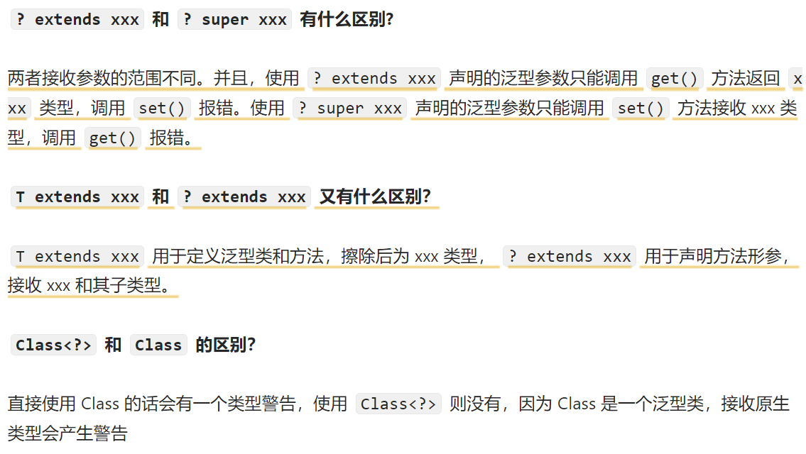

### 标识符和关键字的区别是什么？

在我们编写程序的时候，需要大量地为程序、类、变量、方法等取名字，于是就有了 **标识符** 。简单来说， **标识符就是一个名字** 。

有一些标识符，Java 语言已经赋予了其特殊的含义，只能用于特定的地方，这些特殊的标识符就是 **关键字** 。简单来说，**关键字是被赋予特殊含义的标识符** 。比如，在我们的日常生活中，如果我们想要开一家店，则要给这个店起一个名字，起的这个“名字”就叫标识符。但是我们店的名字不能叫“警察局”，因为“警察局”这个名字已经被赋予了特殊的含义，而“警察局”就是我们日常生活中的关键字。

| 分类                 | 关键字   |            |              |              |               |           |        |
| :------------------- | -------- | ---------- | ------------ | ------------ | ------------- | --------- | ------ |
| 访问控制             | private  | protected  | public       |              |               |           |        |
| 类，方法和变量修饰符 | abstract | class      | extends      | final        | implements    | interface | native |
|                      | new      | static     | **strictfp** | synchronized | **transient** | volatile  | enum   |
| 程序控制             | break    | continue   | return       | do           | while         | if        | else   |
|                      | for      | instanceof | switch       | case         | default       | assert    |        |
| 错误处理             | try      | catch      | throw        | throws       | finally       |           |        |
| 包相关               | import   | package    |              |              |               |           |        |
| 基本类型             | boolean  | byte       | char         | double       | float         | int       | long   |
|                      | short    |            |              |              |               |           |        |
| 变量引用             | super    | this       | void         |              |               |           |        |
| 保留字               | goto     | const      |              |              |               |           |        |

------

###  移位运算符

Java 中有三种移位运算符：

Java 移位运算符总结

- `<<` :左移运算符，向左移若干位，高位丢弃，低位补零。`x << 1`,相当于 x 乘以 2(不溢出的情况下)。
- `>>` :带符号右移，向右移若干位，高位补符号位，低位丢弃。正数高位补 0,负数高位补 1。`x >> 1`,相当于 x 除以 2。
- `>>>` :无符号右移，忽略符号位，空位都以 0 补齐。(最高位补0)

由于 `double`，`float` 在二进制中的表现比较特殊，因此不能来进行移位操作。

移位操作符实际上支持的类型只有`int`和`long`，编译器在对`short`、`byte`、`char`类型进行移位前，都会将其转换为`int`类型再操作。

**如果移位的位数超过数值所占有的位数会怎样？**

当 int 类型左移/右移位数大于等于 32 位操作时，会先求余（%）后再进行左移/右移操作。也就是说左移/右移 32 位相当于不进行移位操作（32%32=0），左移/右移 42 位相当于左移/右移 10 位（42%32=10）。当 long 类型进行左移/右移操作时，由于 long 对应的二进制是 64 位，因此求余操作的基数也变成了 64。

也就是说：`x<<42`等同于`x<<10`，`x>>42`等同于`x>>10`，`x >>>42`等同于`x >>> 10`。

------

### Java 基本数据类型大小

Java 中有 8 种基本数据类型，分别为：

- 6 种数字类型： 
  - 4 种整数型：`byte`、`short`、`int`、`long`
  - 2 种浮点型：`float`、`double`
- 1 种字符类型：`char`
- 1 种布尔型：`boolean`。

这 8 种基本数据类型的默认值以及所占空间的大小如下：

| 基本类型    | 位数 | 字节 | 默认值  | 取值范围                                                     |
| :---------- | :--- | :--- | :------ | ------------------------------------------------------------ |
| `byte`      | 8    | 1    | 0       | -128 ~ 127                                                   |
| **`short`** | 16   | 2    | 0       | -32768（-2^15） ~ 32767（2^15 - 1）                          |
| `int`       | 32   | 4    | 0       | -2147483648 ~ 2147483647                                     |
| `long`      | 64   | 8    | 0L      | -9223372036854775808（-2^63） ~ 9223372036854775807（2^63 -1） |
| **`char`**  | 16   | 2    | 'u0000' | 0 ~ 65535（2^16 - 1）                                        |
| `float`     | 32   | 4    | 0f      | 1.4E-45 ~ 3.4028235E38                                       |
| `double`    | 64   | 8    | 0d      | 4.9E-324 ~ 1.7976931348623157E308                            |
| `boolean`   | 1    |      | false   | true、false                                                  |

------

### 基本类型和包装类型的区别（如int和Integer）？


- **用途**：除了定义一些常量和局部变量之外（**基本类型用在这**），我们在其他地方比如**方法参数、对象属性**(**包装类型用在这**)中很少会使用基本类型来定义变量。并且，**包装类型可用于泛型，而基本类型不可以**。
- **存储方式**：基本数据类型的**局部变量存放在 Java 虚拟机栈中的局部变量表**中，**基本数据类型的成员变量（未被 `static` 修饰 ）存放在 Java 虚拟机的堆中（被static修饰放在方法区中）**。包装类型属于对象类型，我们知道几乎所有对象实例都存在于堆中。
- **占用空间**：相比于包装类型（对象类型）， 基本数据类型占用的空间往往非常小。
- **默认值**：成员变量包装类型不赋值就是 `null` ，而基本类型有默认值且不是 `null`。
- **比较方式**：***对于基本数据类型来说，`==` 比较的是值。对于包装数据类型来说，`==` 比较的是对象的内存地址***。所有整型包装类对象之间值的比较，全部使用 `equals()` 方法。

**为什么说是几乎所有对象实例都存在于堆中呢？** 这是因为 HotSpot 虚拟机引入了 JIT 优化之后，会对对象进行逃逸分析，如果发现某一个对象并没有逃逸到方法外部，那么就可能通过标量替换来实现栈上分配，而避免堆上分配内存

------

### 包装类型的缓存机制了解么？

Java 基本数据类型的包装类型的大部分都用到了缓存机制来提升性能。

`Byte`,`Short`,`Integer`,`Long` 这 4 种包装类默认创建了数值 **[-128，127]** 的相应类型的缓存数据，`Character` 创建了数值在 **[0,127]** 范围的缓存数据，`Boolean` 直接返回 `True` or `False`。**两种浮点数类型的包装类 `Float`,`Double` 并没有实现缓存机制**。

**Integer 缓存源码：**


```java
public static Integer valueOf(int i) {
    if (i >= IntegerCache.low && i <= IntegerCache.high)
        return IntegerCache.cache[i + (-IntegerCache.low)];
    return new Integer(i);
}
private static class IntegerCache {
    static final int low = -128;
    static final int high;
    static {
        // high value may be configured by property
        int h = 127;
    }
}
```

**所有整型包装类对象之间值的比较，全部使用 equals 方法比较**，因为如Integer在-128-127由于缓存用==比较结果为true，但是超出这个范围即使对应的值相等用==比较会是false

------

### 自动装箱与拆箱了解吗？原理是什么？

**什么是自动拆装箱？**

- **装箱**：将基本类型用它们对应的引用类型包装起来；
- **拆箱**：将包装类型转换为基本数据类型；

举例：


```java
Integer i = 10;  //装箱
int n = i;   //拆箱
```

- `Integer i = 10` 等价于 `Integer i = Integer.valueOf(10)`
- `int n = i` 等价于 `int n = i.intValue()`;

注意：**如果频繁拆装箱的话，也会严重影响系统的性能。我们应该尽量避免不必要的拆装箱操作。**


```java
private static long sum() {
    // 应该使用 long 而不是 Long
    Long sum = 0L;
    for (long i = 0; i <= Integer.MAX_VALUE; i++)
        sum += i;
    return sum;
}
```

------

### 浮点数运算的时候会有精度丢失的风险

浮点数运算精度丢失代码演示：


```java
float a = 2.0f - 1.9f;
float b = 1.8f - 1.7f;
System.out.println(a);// 0.100000024
System.out.println(b);// 0.099999905
System.out.println(a == b);// false
```

为什么会出现这个问题呢？

这个和计算机保存浮点数的机制有很大关系。我们知道计算机是二进制的，而且计算机在表示一个数字时，宽度是有限的，无限循环的小数存储在计算机时，只能被截断，所以就会导致小数精度发生损失的情况。这也就是解释了为什么浮点数没有办法用二进制精确表示。

就比如说十进制下的 0.2 就没办法精确转换成二进制小数：


```java
// 0.2 转换为二进制数的过程为，不断乘以 2，直到不存在小数为止，
// 在这个计算过程中，得到的整数部分从上到下排列就是二进制的结果。
0.2 * 2 = 0.4 -> 0
0.4 * 2 = 0.8 -> 0
0.8 * 2 = 1.6 -> 1
0.6 * 2 = 1.2 -> 1
0.2 * 2 = 0.4 -> 0（发生循环）
...
```

* 解决浮点数运算的精度丢失问题

  `BigDecimal` 可以实现对浮点数的运算，不会造成精度丢失。通常情况下，大部分需要浮点数精确运算结果的业务场景（比如涉及到钱的场景）都是通过 `BigDecimal` 来做的。

  ```java
  BigDecimal a = new BigDecimal("1.0");
  BigDecimal b = new BigDecimal("0.9");
  BigDecimal c = new BigDecimal("0.8");
  
  BigDecimal x = a.subtract(b);
  BigDecimal y = b.subtract(c);
  
  System.out.println(x); /* 0.1 */
  System.out.println(y); /* 0.1 */
  System.out.println(Objects.equals(x, y)); /* true */
  
  ```

  

------

### 超过 long 整型的数据应该如何表示

基本数值类型都有一个表达范围，如果超过这个范围就会有数值溢出的风险。

在 Java 中，64 位 long 整型是最大的整数类型。


```java
long l = Long.MAX_VALUE;
System.out.println(l + 1); // -9223372036854775808
System.out.println(l + 1 == Long.MIN_VALUE); // true
```

`BigInteger` 内部使用 `int[]` 数组来存储任意大小的整形数据。

相对于常规整数类型的运算来说，`BigInteger` 运算的效率会相对较低。

------

### 成员变量与局部变量的区别？

* 成员变量可分为类变量和实例变量它们的区别是什么


- **语法形式**：从语法形式上看，**成员变量是属于类的，而局部变量是在代码块或方法中定义的变量或是方法的参数**；成员变量可以被 `public`,`private`,`static` 等修饰符所修饰，而局部变量不能被访问控制修饰符及 `static` 所修饰；但是，成员变量和局部变量都能被 `final` 所修饰。
- **存储方式**：从变量在内存中的存储方式来看，**如果成员变量是使用 `static` 修饰的，那么这个成员变量是属于类的，如果没有使用 `static` 修饰，这个成员变量是属于实例的**。而对象存在于堆内存，局部变量则存在于栈内存。
- **生存时间**：从变量在内存中的生存时间上看，成员变量是对象的一部分，它随着对象的创建而存在，而局部变量随着方法的调用而自动生成，随着方法的调用结束而消亡。
- **默认值**：从变量是否有默认值来看，**成员变量如果没有被赋初始值，则会自动以类型的默认值而赋值**（一种情况例外:被 `final` 修饰的成员变量也必须显式地赋值），**而局部变量则不会自动赋值**。

#### 静态变量作用

静态变量也就是被 `static` 关键字修饰的变量。**它可以被类的所有实例共享**，无论一个类创建了多少个对象，它们都共享同一份静态变量。也就是说，**静态变量只会被分配一次内存**，即使创建多个对象，这样可以节省内存，**静态变量是通过类名来访问的**。


#### **字符**常量和**字符串**常量区别

**形式** : 字符常量是单引号引起的一个字符，字符串常量是双引号引起的 0 个或若干个字符。

**含义** : 字符常量相当于一个整型值( ASCII 值),可以参加表达式运算; 字符串常量代表一个地址值(该字符串在内存中存放位置)。

**占内存大小**：字符常量只占 2 个字节; 字符串常量占若干个字节。


#### 静态方法为什么不能调用非静态成员?

这个需要结合 JVM 的相关知识，主要原因如下：

1. 静态方法是属于类的，在类加载的时候就会分配内存，可以通过类名直接访问。而非静态成员属于实例对象，只有在对象实例化之后才存在，需要通过类的实例对象去访问。
2. 在类的非静态成员不存在的时候静态方法就已经存在了，此时调用在内存中还不存在的非静态成员，属于非法操作。

### 静态方法和实例方法有何不同？

**1、调用方式**

在外部调用静态方法时，可以使用 `类名.方法名` 的方式，也可以使用 `对象.方法名` 的方式，而实例方法只有后面这种方式。也就是说，**调用静态方法可以无需创建对象** 。

不过，需要注意的是一般不建议使用 `对象.方法名` 的方式来调用静态方法。这种方式非常容易造成混淆，静态方法不属于类的某个对象而是属于这个类。

因此，一般建议使用 `类名.方法名` 的方式来调用静态方法。

**2、访问类成员是否存在限制**

静态方法在访问本类的成员时，只允许访问静态成员（即静态成员变量和静态方法），不允许访问实例成员（即实例成员变量和实例方法），而实例方法不存在这个限制。


#### 重载和重写有区别

* 重载

  发生在**同一个类中**（**或者父类和子类之间**），**方法名必须`相同`**，**参数类型不同**、**个数不同、顺序不同**，**方法返回值和访问修饰符`可以不同`**（如果方法的返回类型是 void 和基本数据类型，则返回值重写时不可修改）

* 重写

  重写发生在运行期，**是子类对父类的允许访问的方法的实现过程进行重新编写**。

  1. **方法名、参数列表必须`相同`**，**子类方法返回值类型应比父类方法返回值类型`更小或相等`**，**抛出的异常范围`小于等于父类`****，**`访问修饰`符范围`大于等于`父类**。
  2. 如果父类方法访问修饰符为 **`private/final/static`** 则子类就不能重写该方法，但是被 `static` 修饰的方法能够被再次声明。
  3. 构造方法无法被重写


综上：**重写就是子类对父类方法的重新改造，外部样子不能改变，内部逻辑可以改变。**

| 区别点     | 重载方法 | 重写方法                                                     |
| :--------- | :------- | :----------------------------------------------------------- |
| 发生范围   | 同一个类 | 子类                                                         |
| 参数列表   | 必须修改 | 一定不能修改                                                 |
| 返回类型   | 可修改   | 子类方法返回值类型应比父类方法返回值类型更小或相等           |
| 异常       | 可修改   | 子类方法声明抛出的异常类应比父类方法声明抛出的异常类更小或相等； |
| 访问修饰符 | 可修改   | 一定不能做更严格的限制（可以降低限制）                       |
| 发生阶段   | 编译期   | 运行期                                                       |

#### 可变长参数

从 Java5 开始，Java 支持定义可变长参数，所谓可变长参数就是允许在调用方法时传入不定长度的参数。可变参数只能作为函数的最后一个参数。

**对可变参数的方法进行重载时，会优先匹配固定参数对应的方法**

```java
public class VariableLengthArgument {

    public static void printVariable(String... args) {
        for (String s : args) {
            System.out.println(s);
        }
    }

    public static void printVariable(String arg1, String arg2) {
        System.out.println(arg1 + arg2);
    }

    public static void main(String[] args) {
        printVariable("a", "b");//ab
        printVariable("a", "b", "c", "d");//调用可变长方法
    }
}
```


#### 创建一个对象用什么运算符?对象实体与对象引用有何不同?

new 运算符，new 创建对象实例（对象实例在堆内存中），对象引用（指针）指向对象实例（对象引用存放在栈内存中）。

- 一个对象引用可以指向 0 个或 1 个对象
- 一个对象可以有 n 个引用指向它

#### 对象的相等和引用相等的区别

- 对象的相等一般比较的是内存中存放的内容是否相等。
- 引用相等一般比较的是他们指向的内存地址是否相等。

````java
String str1 = "hello";
String str2 = new String("hello");
String str3 = "hello";
// 使用 == 比较字符串的引用相等（比较对象地址是否相同，因为hello放在字符串常量池了所以str1和str3指向的对象地址相同）
System.out.println(str1 == str2);//false
System.out.println(str1 == str3);//true
// 使用 equals 方法比较字符串的相等
System.out.println(str1.equals(str2));//true
System.out.println(str1.equals(str3));//true


````


#### 构造方法有哪些特点？是否可被 override?

构造方法特点如下：

- 名字与类名相同。
- 没有返回值，但不能用 void 声明构造函数
- 生成类的对象时自动执行，无需调用

构造方法不能被 override（重写）,但是可以 overload（重载）,所以你可以看到一个类中有多个构造函数的情况


#### 继承特点

* 子类拥有父类对象所有的属性和方法（包括私有属性和私有方法），但是父类中的私有属性和方法子类是无法访问，**只是拥有**。

* 子类可以拥有自己属性和方法，即子类可以对父类进行扩展。

* 子类可以用自己的方式实现父类的方法。

#### 多态特点

- 对象类型和引用类型之间具有继承（类）/实现（接口）的关系；
- 引用类型变量发出的方法调用的到底是哪个类中的方法，必须在程序运行期间才能确定；
- 多态不能调用“只在子类存在但在父类不存在”的方法；
- 如果子类重写了父类的方法，真正执行的是子类覆盖的方法，如果子类没有覆盖父类的方法，执行的是父类的方法


#### 接口与抽象类的异同

**共同点**：

- 都不能被实例化。
- 都可以包含抽象方法。（接口能有abstract修饰方法？答案：可以，但是没必要使用）
- 都可以有默认实现的方法（Java 8 可以用 `default` 关键字在接口中定义默认方法）。

**区别**：

- **接口主要用于对类的行为进行约束**，你实现了某个接口就具有了对应的行为。**抽象类主要用于代码复用**，强调的是所属关系。

- 一个类只能继承一个类，但是可以实现多个接口。

- **接口中的成员变量只能是 `public static final` 类型的**，不能被修改且必须有初始值，**而抽象类的成员变量默认 default，可在子类中被重新定义，也可被重新赋值**。

  注：在接口定义了某属性，在其子类中也能定义相同名称的属性，在子类定义相同属性后，如果还需要使用接口中同名属性需要用**接口名.属性**来进行调用


#### 深拷贝与浅拷贝

**浅拷贝**：浅拷贝会在堆上创建一个新的对象（区别于引用拷贝的一点），不过，如果原对象内部的属性是引用类型的话，浅拷贝会直接复制内部对象的引用地址，也就是说拷贝对象和原对象共用同一个内部对象。

**深拷贝**：深拷贝会完全复制整个对象，包括这个对象所包含的内部对象。


#### == 和 equals() 的区别

- 对于基本数据类型来说，`==` 比较的是值。
- 对于引用数据类型来说，`==` 比较的是对象的内存地址。

**`equals()`** 不能用于判断**基本数据类型**的变量（因为基本数据类型不是对象），只能用来判断两个对象是否相等。`equals()`方法存在于`Object`类中，而`Object`类是所有类的直接或间接父类，因此所有的类都有`equals()`方法。

`equals()` 方法存在两种使用情况：

- **类没有重写 `equals()`方法**：通过`equals()`比较该类的两个对象时，等价于通过“==”比较这两个对象，使用的默认是 `Object`类`equals()`方法。
- **类重写了 `equals()`方法**：一般我们都重写 `equals()`方法来比较两个对象中的属性是否相等；若它们的属性相等，则返回 true(即，认为这两个对象相等)。

#### hashcode作用

* hashcode相同是否表示两个对象相同（不是）
* 为什么要提供equals与hashcode两个比较相同的方法（hashcode用于加速比较，equals确保hashcode重复情况下能比较对象是否相等）

`hashCode()` 的作用是获取哈希码（`int` 整数），也称为散列码。这个哈希码的作用是确定该对象在哈希表中的索引位置，hash类对象如Map或者Set使用hashcode与equals来判断容器中是否存在相同元素。

>把对象加入 `HashSet` 时，`HashSet` 会先计算对象的 `hashCode` 值来判断对象加入的位置，同时也会与其他已经加入的对象的 `hashCode` 值作比较，如果没有相符的 `hashCode`，`HashSet` 会假设对象没有重复出现。但是如果发现有相同 `hashCode` 值的对象，这时会调用 `equals()` 方法来检查 `hashCode` 相等的对象是否真的相同。如果两者相同，`HashSet` 就不会让其加入操作成功。如果不同的话，就会重新散列到其他位置。这样我们就大大减少了 `equals` 的次数，相应就大大提高了执行速度。

* 为什么equals与hashcode要同时重写

  因为两个相等的对象的 `hashCode` 值必须是相等。也就是说如果 `equals` 方法判断两个对象是相等的，那这两个对象的 `hashCode` 值也要相等。

  如果重写 `equals()` 时没有重写 `hashCode()` 方法的话就可能会导致 `equals` 方法判断是相等的两个对象，`hashCode` 值却不相等。

  > 重写 `equals()` 时没有重写 `hashCode()` 方法的话，使用 `HashMap` 可能会出现问题


####  String、StringBuffer、StringBuilder 的区别

* 能否修改

  `String` **是不可变的**（后面会详细分析原因）。

  `StringBuilder` 与 `StringBuffer` 都**继承自 `AbstractStringBuilder` 类**，在 `AbstractStringBuilder` 中也是使用字符数组保存字符串，不过没有使用 `final` 和 `private` 关键字修饰，最关键的是这个 `AbstractStringBuilder` 类还提供了很多修改字符串的方法比如 `append` 方法。

* 线程安全性
  * `String` 中的对象是不可变的，也就可以理解为常量，**线程安全**。
  * `StringBuffer` 对方法加了同步锁或者对调用的方法加了同步锁，所以是**线程安全**的。
  * `StringBuilder` 并没有对方法进行加同步锁，所以是**非线程安全的**。
* 性能
  * 每次对 `String` 类型进行改变的时候，都会生成一个新的 `String` 对象，然后将指针指向新的 `String` 对象，性能最差。
  * `StringBuffer` 每次都会对 `StringBuffer` 对象本身进行操作，而不是生成新的对象并改变对象引用。相同情况下使用 `StringBuilder` 相比使用 `StringBuffer` 仅能获得 10%~15% 左右的性能提升，但却要冒多线程不安全的风险。
* 使用建议
  1. 操作少量的数据: 适用 `String`
  2. 单线程操作字符串缓冲区下操作大量数据: 适用 `StringBuilder`
  3. 多线程操作字符串缓冲区下操作大量数据: 适用 `StringBuffer`

#### String为什么是不可变的

* String这个类被final修饰

  `String` 类被 `final` 修饰导致其不能被继承，进而避免了子类破坏 `String` 不可变，因为final定义的类不能被继承

*  String类中保存字符的char数组是private和final共同修饰的

  保存字符串的数组被 `final` 修饰且为私有的，并且`String` 类没有提供/暴露修改这个字符串的方法

  ```java
  public final class String implements java.io.Serializable,Comparable<String>, CharSequence {
      // @Stable 注解表示变量最多被修改一次，称为“稳定的”。
      @Stable
      private final byte[] value;
  }
  ```

#### 字符串常量池作用

为了提升性能和减少内存消耗针对字符串（String 类）专门开辟的一块区域，主要目的是为了避免字符串的重复创建。

####  String s1 = new String("abc");这句话创建了几个字符串对象

其实这个语句要拆分成"abc"和new String，"abc"会被编译器进行优化放在字符串常量池中。故有如下两种可能

* "abc"是代码段中第一次出现，那么将会创建两个对象，即"abc"放在字符串常量池中，new String放在堆中。
* "abc"在上文以及存在过，那么只创建一个对象，即new String这个对象

回答的依据可以用字符串常量池中是否存在对应的字符串。

#### String.intern 方法有什么作用

`String.intern()` 是一个 native（本地）方法，其作用是将指定的字符串对象的引用保存在字符串常量池中，可以简单分为两种情况：

- 如果字符串常量池中保存了对应的字符串对象的引用，就直接返回该引用。
- 如果字符串常量池中没有保存了对应的字符串对象的引用，那就在常量池中创建一个指向该字符串对象的引用并返回。

```java
// 在堆中创建字符串对象”Java“
// 将字符串对象”Java“的引用保存在字符串常量池中
String s1 = "Java";
// 直接返回字符串常量池中字符串对象”Java“对应的引用
String s2 = s1.intern();
// 会在堆中在单独创建一个字符串对象
String s3 = new String("Java");
// 直接返回字符串常量池中字符串对象”Java“对应的引用
String s4 = s3.intern();
// s1 和 s2 指向的是堆中的同一个对象
System.out.println(s1 == s2); // true
// s3 和 s4 指向的是堆中不同的对象
System.out.println(s3 == s4); // false
// s1 和 s4 指向的是堆中的同一个对象
System.out.println(s1 == s4); //true
```

#### String进行+运算时可能的情况

注意：str3和str4并不是指向同一个对象，javac编译优化只优化了str3，str4相当于对象相加不是常量，所以创建了新对象

```java
String str1 = "str";
String str2 = "ing";
String str3 = "str" + "ing";
String str4 = str1 + str2;
String str5 = "string";
System.out.println(str3 == str4);//false
System.out.println(str3 == str5);//true
System.out.println(str4 == str5);//false
```

**对于编译期可以确定值的字符串，也就是常量字符串 ，jvm 会将其存入字符串常量池。并且，字符串常量拼接得到的字符串常量在编译阶段就已经被存放字符串常量池，这个得益于编译器的优化。**

* 基本数据类型( `byte`、`boolean`、`short`、`char`、`int`、`float`、`long`、`double`)以及字符串常量。

* **`final` 修饰的基本数据类型和字符串变量(且编译时已经被赋值了)**

  ```java
  final String str1 = "str";
  final String str2 = "ing";
  // 下面两个表达式其实是等价的
  String c = "str" + "ing";// 常量池中的对象
  String d = str1 + str2; // 常量池中的对象
  System.out.println(c == d);// true
  ```

  被 `final` 关键字修饰之后的 `String` 会被编译器当做常量来处理，编译器在程序编译期就可以确定它的值，其效果就相当于访问常量。

  如果 ，编译器在运行时才能知道其确切值的话，就无法对其优化

  ```java
  final String str1 = "str";
  final String str2 = getStr();
  String c = "str" + "ing";// 常量池中的对象
  String d = str1 + str2; // 在堆上创建的新的对象
  System.out.println(c == d);// false
  public static String getStr() {
        return "ing";
  }
  ```

* 字符串通过 “+”拼接得到的字符串、基本数据类型之间算数运算（加减乘除）、基本数据类型的位运算（<<、>>、>>> ）

#### 异常体系结构


* Exception与Error

  * **`Exception`** :程序本身可以处理的异常，可以通过 `catch` 来进行捕获。`Exception` 又可以分为 Checked Exception (受检查异常，必须处理) 和 Unchecked Exception (不受检查异常，可以不处理)。

  * **`Error`**：`Error` 属于程序无法处理的错误 ，不建议通过`catch`捕获 。例如 Java 虚拟机运行错误（`Virtual MachineError`）、虚拟机内存不够错误(`OutOfMemoryError`)、类定义错误（`NoClassDefFoundError`）等 。这些异常发生时，Java 虚拟机（JVM）一般会选择线程终止。

* check与uncheck
  * **Checked Exception** 即 受检查异常 ，Java 代码在编译过程中，如果受检查异常没有被 `catch`或者`throws` 关键字处理的话，就**没办法通过编译**
  * **Unchecked Exception** 即 **不受检查异常** ，Java 代码在编译过程中 ，我们即使不处理不受检查异常也可以正常通过编译。

#### Throwable常用方法

- `String getMessage()`: 返回异常发生时的简要描述
- `String toString()`: 返回异常发生时的详细信息
- **`String getLocalizedMessage()`**: 返回异常对象的本地化信息。使用 `Throwable` 的子类覆盖这个方法，可以生成本地化信息。如果子类没有覆盖该方法，则该方法返回的信息与 `getMessage()`返回的结果相同
- `void printStackTrace()`: 在控制台上打印 `Throwable` 对象封装的异常信息

#### try-catch-finally结构

- `try`块：用于捕获异常。其后可接零个或多个 `catch` 块，**如果没有 `catch` 块，则必须跟一个 `finally` 块。**
- `catch`块：用于处理 try 捕获到的异常。
- `finally` 块：无论是否捕获或处理异常，`finally` 块里的语句都会被执行。当在 `try` 块或 `catch` 块中遇到 `return` 语句时，`finally` 语句块将在方法返回之前被执行。

**注意：不要在 finally 语句块中使用 return!** 当 try 语句和 finally 语句中都有 return 语句时，try 语句块中的 return 语句会被忽略。这是因为 try 语句中的 return 返回值会先被暂存在一个本地变量中，当执行到 finally 语句中的 return 之后，这个本地变量的值就变为了 finally 语句中的 return 返回值。

#### finally语句是否一定会被指向

* finally 之前虚拟机被终止运行的话，finally 中的代码就不会被执行

  ```java
  try {
      System.out.println("Try to do something");
      throw new RuntimeException("RuntimeException");
  } catch (Exception e) {
      System.out.println("Catch Exception -> " + e.getMessage());
      // 终止当前正在运行的Java虚拟机
      System.exit(1);
  } finally {
      System.out.println("Finally");
  }
  
  ```

* 程序所在的线程死亡或关闭cpu也会导致finally不被执行

#### 异常使用规范

- 不要把异常定义为静态变量，因为这样会导致异常栈信息错乱。每次手动抛出异常，我们都需要手动 new 一个异常对象抛出。
- 抛出的异常信息一定要有意义。
- 建议抛出更加**具体的异常**比如字符串转换为数字格式错误的时候应该抛出`NumberFormatException`而不是其父类`IllegalArgumentException`。
- **使用日志打印异常之后就不要再抛出异常了（两者不要同时存在一段代码逻辑中）**。

#### 泛型的作用与类型

**Java 泛型（Generics）** 是 JDK 5 中引入的一个新特性。使用泛型参数，**可以增强代码的可读性 稳定性 可复用性。**

泛型一般有三种使用方式:**泛型类**、**泛型接口**、**泛型方法**。

#### 泛型擦除

虚拟机中没有泛型，只有普通类和普通方法，所有泛型类的类型参数在编译时都会被擦除，泛型类并没有自己独有的`Class`类对象。比如并不存在`List<String>.class`或是`List<Integer>.class`，而只有`List.class`

1. 将所有的泛型参数用其最左边界（最顶级的父类型）类型替换

   ```java
   public static <A extends Comparable<A>> A max(Collection<A> xs) {
       Iterator<A> xi = xs.iterator();
       A w = xi.next();
       while (xi.hasNext()) {
           A x = xi.next();
           if (w.compareTo(x) < 0)
               w = x;
       }
       return w;
   }
   //擦除后
    public static Comparable max(Collection xs){
       Iterator xi = xs.iterator();
       Comparable w = (Comparable)xi.next();
       while(xi.hasNext())
       {
           Comparable x = (Comparable)xi.next();
           if(w.compareTo(x) < 0)
               w = x;
       }
       return w;
   }
   
   ```

2. 移除所有的类型参数

   ```java
   Map<String, String> map = new HashMap<String, String>();
   map.put("name", "hollis");
   map.put("wechat", "Hollis");
   map.put("blog", "www.hollischuang.com");
   //擦除后
   Map map = new HashMap();
   map.put("name", "hollis");
   map.put("wechat", "Hollis");
   map.put("blog", "www.hollischuang.com"); 
   ```

#### 泛型可能会到的问题

**一、当泛型遇到重载**

```java
public class GenericTypes {

    public static void method(List<String> list) {
        System.out.println("invoke method(List<String> list)");
    }

    public static void method(List<Integer> list) {
        System.out.println("invoke method(List<Integer> list)");
    }
}
```

上面这段代码，有两个重载的函数，因为他们的参数类型不同，一个是`List<String>`另一个是`List<Integer>` ，但是，这段代码是编译通不过的。因为我们前面讲过，参数`List<Integer>`和`List<String>`编译之后都被擦除了，变成了一样的原生类型 List，擦除动作导致这两个方法的特征签名变得一模一样。

**二、当泛型遇到 catch**

泛型的类型参数不能用在 Java 异常处理的 catch 语句中。因为异常处理是由 JVM 在运行时刻来进行的。由于类型信息被擦除，JVM 是无法区分两个异常类型`MyException<String>`和`MyException<Integer>`的

#### 泛型限制

泛型的限制一般是由泛型擦除机制导致的。擦除为 object 后无法进行类型判断

* 只能声明不能实例化 T 类型变量

  不管是在范型类还是范型方法中都不能存在类似`T t = new T()`的代码，因为不知道T类的构造函数是何种类型的。

* 泛型参数不能是基本类型。因为基本类型不是 object 子类，应该用基本类型对应的引用类型代
  替。（如，不能用<int>,而要用<interger>）

* 不能实例化泛型的数组。擦除后为 obiect 后无法进行类型判断

* 泛型无法使用 Instance of 和 getclass() 进行类型判断。

* 不能实现两个不同泛型参数的同一接口，擦除后多个父类的桥方法将冲突

* 不能使用 static 修饰泛型变量

  如下代码无法编译，因为不能用static修饰泛型变量，因为泛型的目的就是为了用通配性，static变量是类变量，具有唯一性，放在方法区。

  ```java
  Class MyClass<T> {
   static T instance;
  }
  
  ```

#### 泛型通配符

* ？与T的区别

  * T可以用于声明变量或常量而 ? 不行
  * T一般用于声明泛型类或方法，通配符 ? 一般用于泛型方法的调用代码和形参
  * T在编译期会被擦除为限定类型或 object ，通配符用于捕获具体类型。

* ？无界通配符作用

  无界通配符可以接收任何泛型类型数据，用于实现不依赖于具体类型参数的简单方法，可以捕获参数类型并交由泛型方法进行处理。

  * List<?>与List区别
    * List<?>list 表示 list 是持有某种特定类型的 List，但是不知道具体是哪种类型。因此，我们
      添加元素进去的时候会报错。
    * List list 表示 list 是持有的元素的类型是 object ，因此可以添加任何类型的对象，只不过
      编译器会有警告信息。

* 上边界通配符和下边界通配符

  * <? extends T> 上边界

    上边界通配符extends 可以实现泛型的向上转型，**即传入的类型实参必须是指定类型的子类型**

  * <? super T> 下边界

    下边界通配符 super 与上边界通配符 extends 刚好相反，它可以实现泛型的向下转型即**传入的类型实参必须是指定类型的父类型。**

  

#### 获取Class对象的方式

**1. 知道具体类的情况下可以使用：**

```java
Class alunbarClass = TargetObject.class;
```

但是我们一般是不知道具体类的，基本都是通过遍历包下面的类来获取 Class 对象，通过此方式获取 Class 对象不会进行初始化

**2. 通过 `Class.forName()`传入类的全路径获取：**

```java
Class alunbarClass1 = Class.forName("cn.javaguide.TargetObject");
```

**3. 通过对象实例`instance.getClass()`获取：**

```java
TargetObject o = new TargetObject();
Class alunbarClass2 = o.getClass();
```

**4. 通过类加载器`xxxClassLoader.loadClass()`传入类路径获取:**

```java
ClassLoader.getSystemClassLoader().loadClass("cn.javaguide.TargetObject");
```

通过类加载器获取 Class 对象不会进行初始化，意味着不进行包括初始化等一系列步骤，静态代码块和静态对象不会得到执行

#### 注解的作用

`Annotation` （注解） 是 Java5 开始引入的新特性，可以看作是一种特殊的注释，**主要用于修饰类、方法或者变量**，提供某些信息供程序在编译或者运行时使用。

#### 序列化与反序列化概念

- **序列化**：将数据结构或对象转换成二进制字节流的过程
- **反序列化**：将在序列化过程中所生成的二进制字节流转换成数据结构或者对象的过程

* 常见的序列化与反序列需求
  * 对象在进行**网络传输**（比如远程方法调用 RPC 的时候）之前需要先被序列化，接收到序列化的对象之后需要再进行反序列化；
  * 将对象存储到文件之前需要进行序列化，将对象从文件中读取出来需要进行反序列化；
  * 将对象**存储到数据库**（如 Redis）之前需要用到序列化，将对象从缓存数据库中读取出来需要反序列化；
  * 将对象存**储到内存**之前需要进行序列化，从内存中读取出来之后需要进行反序列化。


#### serialVersionUID的作用

序列化号 `serialVersionUID` **属于版本控制的作用**。反序列化时，会检查 `serialVersionUID` 是否和当前类的 `serialVersionUID` 一致。如果 `serialVersionUID` 不一致则会抛出 `InvalidClassException` 异常。强烈推荐每个序列化类都手动指定其 `serialVersionUID`，如果不手动指定，那么编译器会动态生成默认的 `serialVersionUID`。

#### Java默认序列方案中transient的作用

`transient` 关键字的作用是：阻止实例中那些用此关键字修饰的的变量序列化；当对象被反序列化时，被 `transient` 修饰的变量值不会被持久化和恢复。

关于 `transient` 还有几点注意：

- `transient` **只能修饰变量**，不能修饰类和方法。
- `transient` 修饰的变量，在反序列化后变量值将会被置成类型的默认值。例如，如果是修饰 `int` 类型，那么反序列后结果就是 `0`。
- **`static` 变量因为不属于任何对象(Object)，所以无论有没有 `transient` 关键字修饰，均不会被序列化。**

#### Java自带序列化问题

- **不支持跨语言调用** : 如果调用的是其他语言开发的服务的时候就不支持了。
- **性能差**：相比于其他序列化框架性能更低，主要原因是序列化之后的字节数组体积较大，导致传输成本加大。
- **存在安全问题**：序列化和反序列化本身并不存在问题。但当输入的反序列化的数据可被用户控制，那么攻击者即可通过构造恶意输入，让反序列化产生非预期的对象，在此过程中执行构造的任意代码。

#### IO流分类

Java IO 流的 40 多个类都是从如下 4 个抽象类基类中派生出来的。

- `InputStream`/`Reader`: 所有的输入流的基类，前者是字节输入流，后者是字符输入流。
- `OutputStream`/`Writer`: 所有输出流的基类，前者是字节输出流，后者是字符输出流

* IO流常用的方法

  * InputStream

    - `read()`：返回输入流中下一个字节的数据。返回的值介于 0 到 255 之间。如果未读取任何字节，则代码返回 `-1` ，表示文件结束。
    - `read(byte b[ ])` : 从输入流中读取一些字节存储到数组 `b` 中。如果数组 `b` 的长度为零，则不读取。如果没有可用字节读取，返回 `-1`。如果有可用字节读取，则最多读取的字节数最多等于 `b.length` ， 返回读取的字节数。这个方法等价于 `read(b, 0, b.length)`。
    - `read(byte b[], int off, int len)`：在`read(byte b[ ])` 方法的基础上增加了 `off` 参数（偏移量）和 `len` 参数（要读取的最大字节数）。
    - `skip(long n)`：忽略输入流中的 n 个字节 ,返回实际忽略的字节数。
    - `available()`：返回输入流中可以读取的字节数。
    - `close()`：关闭输入流释放相关的系统资源。

    从 Java 9 开始，`InputStream` 新增加了多个实用的方法：

    - `readAllBytes()`：读取输入流中的所有字节，返回字节数组。
    - `readNBytes(byte[] b, int off, int len)`：**阻塞**直到读取 `len` 个字节。
    - `transferTo(OutputStream out)`：**将所有字节从一个输入流传递到一个输出流。**

  * OutputStream

    `OutputStream`用于将数据（字节信息）写入到目的地（通常是文件），`java.io.OutputStream`抽象类是所有字节输出流的父类。

    `OutputStream` 常用方法：

    - `write(int b)`：将特定字节写入输出流。
    - `write(byte b[ ])` : 将数组`b` 写入到输出流，等价于 `write(b, 0, b.length)` 。
    - `write(byte[] b, int off, int len)` : 在`write(byte b[ ])` 方法的基础上增加了 `off` 参数（偏移量）和 `len` 参数（要读取的最大字节数）。
    - `flush()`：刷新此输出流并强制写出所有缓冲的输出字节。
    - `close()`：关闭输出流释放相关的系统资源。

  * Reader

    * `read()` : 从输入流读取一个字符。
    * `read(char[] cbuf)` : 从输入流中读取一些字符，并将它们存储到字符数组 `cbuf`中，等价于 `read(cbuf, 0, cbuf.length)` 。
    * `read(char[] cbuf, int off, int len)`：在`read(char[] cbuf)` 方法的基础上增加了 `off` 参数（偏移量）和 `len` 参数（要读取的最大字符数）。
    * `skip(long n)`：忽略输入流中的 n 个字符 ,返回实际忽略的字符数。

    `close()` : 关闭输入流并释放相关的系统资源。

  * Writer

    * `write(int c)` : 写入单个字符。
    * `write(char[] cbuf)`：写入字符数组 `cbuf`，等价于`write(cbuf, 0, cbuf.length)`。
    * `write(char[] cbuf, int off, int len)`：在`write(char[] cbuf)` 方法的基础上增加了 `off` 参数（偏移量）和 `len` 参数（要读取的最大字符数）。
    * `write(String str)`：写入字符串，等价于 `write(str, 0, str.length())` 。
    * `write(String str, int off, int len)`：在`write(String str)` 方法的基础上增加了 `off` 参数（偏移量）和 `len` 参数（要读取的最大字符数）。
    * `append(CharSequence csq)`：将指定的字符序列附加到指定的 `Writer` 对象并返回该 `Writer` 对象。
    * `append(char c)`：将指定的字符附加到指定的 `Writer` 对象并返回该 `Writer` 对象。
    * `flush()`：刷新此输出流并强制写出所有缓冲的输出字符。
    * `close()`:关闭输出流释放相关的系统资源。

#### IO采用的设计模式有哪些

* 装饰器模式

  装饰器模式通过组合替代**继承来扩展原始类的功能**，如BufferIN/OUT系列

* 适配器模式

  主要用于接口互不兼容的类的协调工作，如`InputStream` 和 `OutputStream` 的子类是被适配者， `InputStreamReader` 和 `OutputStreamWriter`是适配器。

  ```java
  // InputStreamReader 是适配器，FileInputStream 是被适配的类
  InputStreamReader isr = new InputStreamReader(new FileInputStream(fileName), "UTF-8");
  // BufferedReader 增强 InputStreamReader 的功能（装饰器模式）
  BufferedReader bufferedReader = new BufferedReader(isr);
  
  ```

* 工厂模式

  工厂模式用于创建对象

* 观察者模式

  NIO 中的文件目录监听服务使用到了观察者模式，或者监听网络端口


#### BIO、NIO、AIO三种模型

* **BIO 同步阻塞 IO 模型** 

  同步阻塞 IO 模型中，应用程序发起 read 调用后，会一直阻塞，直到内核把数据拷贝到用户空间。


* NIO 

  * 同步非阻塞模型

    同步非阻塞 IO 模型中，应用程序会一直发起 read 调用，等待数据从内核空间拷贝到用户空间的这段时间里，线程依然是阻塞的，直到在内核把数据拷贝到用户空间。

    相比于同步阻塞 IO 模型，同步非阻塞 IO 模型确实有了很大改进。通过轮询操作，避免了一直阻塞。

    但是，这种 IO 模型同样存在问题：**应用程序不断进行 I/O 系统调用轮询数据是否已经准备好的过程是十分消耗 CPU 资源的。**

    

  * IO多路复用

    IO 多路复用模型中，线程首先发起 select 调用，询问内核数据是否准备就绪，等内核把数据准备好了，用户线程再发起 read 调用。read 调用的过程（数据从内核空间 -> 用户空间）还是阻塞的。

    
  
    > 目前支持 IO 多路复用的系统调用，有 select，epoll 等等。select 系统调用，目前几乎在所有的操作系统上都有支持。
    >
    > - **select 调用**：内核提供的系统调用，它支持一次查询多个系统调用的可用状态。几乎所有的操作系统都支持。
    > - **epoll 调用：linux 2.6 内核，属于 select 调用的增强版本，优化了 IO 的执行效率。**
  
    **IO 多路复用模型，通过减少无效的系统调用，减少了对 CPU 资源的消耗。**
  
    Java 中的 NIO ，有一个非常重要的**选择器 ( Selector )** 的概念，也可以被称为 **多路复用器**。通过它，只需要一个线程便可以管理多个客户端连接。当客户端数据到了之后，才会为其服务。
  
    
  
  * AIO
  
    异步 IO 是基于事件和回调机制实现的，也就是**应用操作之后会直接返回，不会堵塞在那里，当后台处理完成，操作系统会通知相应的线程进行后续的操作**。
  
    

#### Unsafe类作用

1. **内存操作（堆外内存操作）**

   ```java
   //分配新的本地空间
   public native long allocateMemory(long bytes);
   //重新调整内存空间的大小
   public native long reallocateMemory(long address, long bytes);
   //将内存设置为指定值
   public native void setMemory(Object o, long offset, long bytes, byte value);
   //内存拷贝
   public native void copyMemory(Object srcBase, long srcOffset,Object destBase, long destOffset,long bytes);
   //清除内存
   public native void freeMemory(long address);
   ```

   案例：

   ```java
   private void memoryTest() {
       int size = 4;
       long addr = unsafe.allocateMemory(size);
       long addr3 = unsafe.reallocateMemory(addr, size * 2);
       System.out.println("addr: "+addr);
       System.out.println("addr3: "+addr3);
       try {
           unsafe.setMemory(null,addr ,size,(byte)1);
           for (int i = 0; i < 2; i++) {
               unsafe.copyMemory(null,addr,null,addr3+size*i,4);
           }
           System.out.println(unsafe.getInt(addr));
           System.out.println(unsafe.getLong(addr3));
       }finally {
           unsafe.freeMemory(addr);
           unsafe.freeMemory(addr3);
       }
   }
   //结果
   addr: 2433733895744
   addr3: 2433733894944
   16843009
   72340172838076673
   
   ```

   分析：

   首先使用`allocateMemory`方法申请 4 字节长度的内存空间，调用`setMemory`方法**向每个字节写入内容为`byte`类型的 1**，当使用 Unsafe 调用`getInt`方法时，因为一个`int`型变量占 4 个字节，会一次性读取 4 个字节，组成一个`int`的值，对应的十进制结果为 16843009。

   

   ------

   在代码中调用`reallocateMemory`方法重新分配了一块 8 字节长度的内存空间，通过比较`addr`和`addr3`可以看到和之前申请的内存地址是不同的。在代码中的第二个 for 循环里，调用`copyMemory`方法进行了两次内存的拷贝，每次拷贝内存地址`addr`开始的 4 个字节，分别拷贝到以`addr3`和`addr3+4`开始的内存空间上：

   

   拷贝完成后，使用`getLong`方法一次性读取 8 个字节，得到`long`类型的值为 72340172838076673。

   **需要注意，通过这种方式分配的内存属于 堆外内存 ，是无法进行垃圾回收的，需要我们把这些内存当做一种资源去手动调用`freeMemory`方法进行释放，否则会产生内存泄漏。通用的操作内存方式是在`try`中执行对内存的操作，最终在`finally`块中进行内存的释放。**

2. **内存屏障（防止指令重排和让cache失效）**

   在介绍内存屏障前，需要知道编译器和 CPU 会在保证程序输出结果一致的情况下，会对代码进行重排序，从指令优化角度提升性能。而指令重排序可能会带来一个不好的结果，导致 CPU 的高速缓存和内存中数据的不一致，而**内存屏障（`Memory Barrier`）就是通过阻止屏障两边的指令重排序从而避免编译器和硬件的不正确优化情况**。

   在硬件层面上，内存屏障是 CPU 为了防止代码进行重排序而提供的指令，不同的硬件平台上实现内存屏障的方法可能并不相同。**在 Java8 中，引入了 3 个内存屏障的函数**，它屏蔽了操作系统底层的差异，允许在代码中定义、并统一由 JVM 来生成内存屏障指令，来实现内存屏障的功能。

   ```java
   //内存屏障，禁止load操作重排序。屏障前的load操作不能被重排序到屏障后，屏障后的load操作不能被重排序到屏障前
   public native void loadFence();
   //内存屏障，禁止store操作重排序。屏障前的store操作不能被重排序到屏障后，屏障后的store操作不能被重排序到屏障前
   public native void storeFence();
   //内存屏障，禁止load、store操作重排序
   public native void fullFence();
   ```

   **内存屏障可以看做对内存随机访问的操作中的一个同步点，使得此点之前的所有读写操作都执行后才可以开始执行此点之后的操作。以`loadFence`方法为例，它会禁止读操作重排序，保证在这个屏障之前的所有读操作都已经完成，并且将缓存数据设为无效，重新从主存中进行加载。**

   ```java
   @Getter
   class ChangeThread implements Runnable{
       /**volatile**/ boolean flag=false;
       @Override
       public void run() {
           try {
               Thread.sleep(3000);
           } catch (InterruptedException e) {
               e.printStackTrace();
           }
           System.out.println("subThread change flag to:" + flag);
           flag = true;
       }
   }
   public static void main(String[] args){
       ChangeThread changeThread = new ChangeThread();
       new Thread(changeThread).start();
       while (true) {
           boolean flag = changeThread.isFlag();
           unsafe.loadFence(); //加入读内存屏障
           if (flag){
               System.out.println("detected flag changed");
               break;
           }
       }
       System.out.println("main thread end");
   }
   subThread change flag to:false
   detected flag changed
   main thread end
   ```

   如果删掉上面代码中的`loadFence`方法，那么主线程将无法感知到`flag`发生的变化，会一直在`while`中循环。可以用图来表示上面的过程：

   

   了解 Java 内存模型（`JMM`）的小伙伴们应该清楚，**运行中的线程不是直接读取主内存中的变量的，只能操作自己工作内存中的变量，然后同步到主内存中，并且线程的工作内存是不能共享的**。上面的图中的流程就是子线程借助于主内存，将修改后的结果同步给了主线程，进而修改主线程中的工作空间，跳出循环。

3. 对象操作

   ```java
   import sun.misc.Unsafe;
   import java.lang.reflect.Field;
   
   public class Main {
   
       private int value;
   
       public static void main(String[] args) throws Exception{
           Unsafe unsafe = reflectGetUnsafe();
           assert unsafe != null;
           long offset = unsafe.objectFieldOffset(Main.class.getDeclaredField("value"));
           Main main = new Main();
           System.out.println("value before putInt: " + main.value);
           unsafe.putInt(main, offset, 42);
           System.out.println("value after putInt: " + main.value);
     System.out.println("value after putInt: " + unsafe.getInt(main, offset));
       }
   
       private static Unsafe reflectGetUnsafe() {
           try {
               Field field = Unsafe.class.getDeclaredField("theUnsafe");
               field.setAccessible(true);
               return (Unsafe) field.get(null);
           } catch (Exception e) {
               e.printStackTrace();
               return null;
           }
       }
   
   }
   value before putInt: 0
   value after putInt: 42
   value after putInt: 42
   ```

   **对象属性**

   对象成员属性的内存偏移量获取，以及字段属性值的修改，在上面的例子中我们已经测试过了。除了前面的`putInt`、`getInt`方法外，Unsafe 提供了全部 8 种基础数据类型以及`Object`的`put`和`get`方法，并且**所有的`put`方法都可以越过访问权限，直接修改内存中的数据（不用和反射一样setAccess）**。阅读 openJDK 源码中的注释发现，基础数据类型和`Object`的读写稍有不同，基础数据类型是直接操作的属性值（`value`），而`Object`的操作则是基于引用值（`reference value`）。下面是`Object`的读写方法：

   ```java
   //在对象的指定偏移地址获取一个对象引用
   public native Object getObject(Object o, long offset);
   //在对象指定偏移地址写入一个对象引用
   public native void putObject(Object o, long offset, Object x);
   ```

   除了对象属性的普通读写外，`Unsafe` 还提供了 **volatile 读写**和**有序写入**方法。`volatile`读写方法的覆盖范围与普通读写相同，包含了全部基础数据类型和`Object`类型，以`int`类型为例：

   ```java
   //在对象的指定偏移地址处读取一个int值，支持volatile load语义
   public native int getIntVolatile(Object o, long offset);
   //在对象指定偏移地址处写入一个int，支持volatile store语义
   public native void putIntVolatile(Object o, long offset, int x);
   ```

   相对于普通读写来说，`volatile`读写具有更高的成本，因为它需要保证可见性和有序性。在执行`get`操作时，会强制从主存中获取属性值，在使用`put`方法设置属性值时，会强制将值更新到主存中，从而保证这些变更对其他线程是可见的。

   有序写入的方法有以下三个：

   ```java
   public native void putOrderedObject(Object o, long offset, Object x);
   public native void putOrderedInt(Object o, long offset, int x);
   public native void putOrderedLong(Object o, long offset, long x);
   ```

   有序写入的成本相对`volatile`较低，因为它只保证写入时的有序性，而不保证可见性，也就是一个线程写入的值不能保证其他线程立即可见。为了解决这里的差异性，需要对内存屏障的知识点再进一步进行补充，首先需要了解两个指令的概念：

   - `Load`：将主内存中的数据拷贝到处理器的缓存中
   - `Store`：将处理器缓存的数据刷新到主内存中

   顺序写入与`volatile`写入的差别在于，在顺序写时加入的内存屏障类型为`StoreStore`类型，而在`volatile`写入时加入的内存屏障是`StoreLoad`类型，如下图所示：

   

   在有序写入方法中，使用的是`StoreStore`屏障，该屏障确保`Store1`立刻刷新数据到内存，这一操作先于`Store2`以及后续的存储指令操作。而在`volatile`写入中，使用的是`StoreLoad`屏障，该屏障确保`Store1`立刻刷新数据到内存，这一操作先于`Load2`及后续的装载指令，并且，`StoreLoad`屏障会使该屏障之前的所有内存访问指令，包括存储指令和访问指令全部完成之后，才执行该屏障之后的内存访问指令。

   综上所述，在上面的三类写入方法中，在写入效率方面，按照`put`、`putOrder`、`putVolatile`的顺序效率逐渐降低。

4. 数组操作

   

5. CAS 操作

   

6. 线程调度

   

7. Class 操作

   

8. 系统信息

   