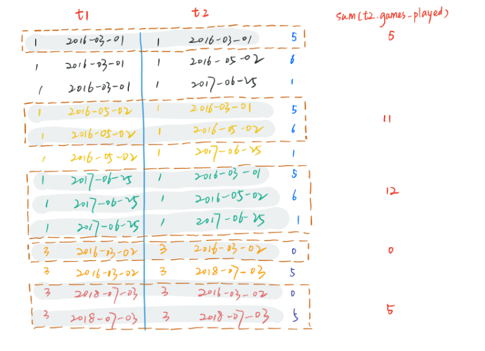

```
输入：
Activity table:
+-----------+-----------+------------+--------------+
| player_id | device_id | event_date | games_played |
+-----------+-----------+------------+--------------+
| 1         | 2         | 2016-03-01 | 5            |
| 1         | 2         | 2016-05-02 | 6            |
| 1         | 3         | 2017-06-25 | 1            |
| 3         | 1         | 2016-03-02 | 0            |
| 3         | 4         | 2018-07-03 | 5            |
+-----------+-----------+------------+--------------+
输出：
+-----------+------------+---------------------+
| player_id | event_date | games_played_so_far |
+-----------+------------+---------------------+
| 1         | 2016-03-01 | 5                   |
| 1         | 2016-05-02 | 11                  |
| 1         | 2017-06-25 | 12                  |
| 3         | 2016-03-02 | 0                   |
| 3         | 2018-07-03 | 5                   |
+-----------+------------+---------------------+
```

求组内games_played的累加和

* 解法一：窗口函数+聚合函数

  ```sql
  select 
  player_id, 
  event_date,
  sum(games_played) over(partition by player_id order by event_date) as games_played_so_far 
  from Activity
  ```

* 解法二：**inner join + group by + sum**

  ```sql
  select a.player_id, a.event_date, sum(b.games_played) as games_played_so_far
  from activity a join activity b
  on a.player_id = b.player_id ## 笛卡尔积。正常的 join 应该是两个主键都用上
  where a.event_date >= b.event_date
  group by a.player_id, a.event_date;
  ```

  * 分析：

  1. 第一步：自联结，得到图中整体的表。

  ```sql
  select t1.player_id,t1.event_date
  from Activity t1,Activity t2
  where t1.player_id=t2.player_id
  ```

  2. 第二步：找到时间在自身前面的数据,如图中灰色笔画出的部分。
     t1.event_date>=t2.event_date

  3. 第三步：用sum()配合分组语句group by对两个主键进行分组并求和，如图中棕色虚线圈出的部分。


  

  