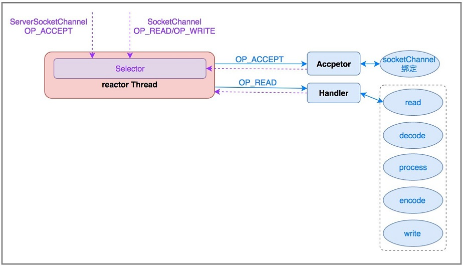

# BIO、NIO、AIO区别

见JavaIO篇分析内容

https://javaguide.cn/java/io/io-model.html

# Netty分析

### Netty是什么

> Netty 是一个**基于 NIO** 的 **client-server(客户端服务器)框架**，使用它可以快速简单地开发网络应用程序。
> 它极大地**简化并优化**了 TCP 和 UDP 套接字服务器等网络编程，并且性能以及安全性等很多方面甚至都要更好。
> **支持多种协议** 如 FTP，SMTP，HTTP 以及各种二进制和基于文本的传统协议。

### 为什么不直接使用Java Nio

> Java的编程模型复杂而目存在一些 BUG.
>
> 复杂:解决断连重连、包丢失、粘包等问题
>
> Bug:

### Netty优点

> 使用**统一的API**封装了多种传输类型的阻塞和非阻塞网络模型
>
> 优秀的编程模型(channel handler)
>
> 自带编码器解决TCP粘包/拆包,并默认支持多种网络协议
>
> 比直接使用Java NIO更加简单且高性能
>
> 安全性好 社区活跃 很多大型项目基于netty开发网络模块

### Netty模型以及核心组件

#### Reactor模型与调用链

* 什么是Reactor模型

  

* 单线程Reactor模型

  所有IO操作（accpet、read、write、encode、decode、process）都由同一个NIO线程处理，对系统资源消耗小，但是无法处理大量请求，且处理过程可能非常缓慢

  > netty单线程reactor模型
  >
  > ```java
  > EventLoopGroup group= new NioEventLoopGroup(1);
  > new ServerBootstrap().group(group,group)
  > ```
  >
  > 

  

* 多线Reactor模型

  一个线程负责连接建立，多个线程负责处理读写，极大并发下建立连接线程可能会产生性能瓶颈

  > netty多线程reactor模型
  >
  > ```java
  > EventLoopGroup bossGroup= new NioEventLoopGroup(1);
  > EventLoopGroup workerGroup= new NioEventLoopGroup();
  > new ServerBootstrap().group(bossGroup,workerGroup)
  > ```
  >
  > 

  

* 主从多线程Reactor

  > netty主从多线程reactor模型
  >
  > ```java
  > EventLoopGroup bossGroup= new NioEventLoopGroup();
  > EventLoopGroup workerGroup= new NioEventLoopGroup();
  > new ServerBootstrap().group(bossGroup,workerGroup)
  > ```

  一组NIO线程负责建立连接，一组NIO线程负责处理IO操作

#### 核心组件

* EventLoop\EventLoopGroup线程

  > NioEventLoopGroup默认构造函数启动多数个线程

  1. EventLoop 

     EventLoop 的主要作用实际就是**负责监听网络事件并调用事件处理器进行相关 I/0 操作(读写)的处理**。channel 为 Netty 网络操作(读写等操作)抽象类， EventLoop 负责处理注册到其上的 Channel 的 I/0 操作，两者配合进行 I/0 操作。

  2. EventLoop与EventLoopGroup(类似ThreadGroup与Thread关系)

     EventLoopGroup 包含多个 EventLoop(每一个 EventLoop 通常内部包含一个线程) ，它管理着所有的EventLoop 的生命周期

* ByteBuf

  * 为什么不直接使用java的bytebuffer
    * java的bytebuffer使用更加复杂
  * 与直接使用byte数组比有什么区别

* handler

  > handler接口中方法的生命周期分析
  >
  > handler事件传递调用什么方法
  >
  > handler共享问题
  >
  > 常用的handler以及对应的功能
  >
  > channelRead和channelRead0区别

  handler就是消息事件处理器，负责处理客户端和服务端接收和发送数据

* channel

  > channel的方法有哪些
  >
  > 怎么使用channelgroup或者其它方案管理channel

  网络连接的管道,直接读和写

* pipeline

  当 Channel被创建时，它会被自动地分配到它专属的 ChannelPipeline，一个 Channel 包含一个ChannelPipeline 。ChannelPipeline 为 ChannelHandler 的链，一个pipeline 上可以有多个 ChannelHandler。可以通过pipline的addLast方法添加handler处理器，

* ChannelHandlerContext

  当 ChannelHandler 被添加到的 ChannelPipeline 它得到一个 ChannelHandlerContext ，它代表一个ChannelHandler 和 ChannelPipeline 之间的绑定，ChannelPipeline 通过 ChannelHandlerContext 来间接管理 ChannelHandler 。

* ChannelFuture

  > 同步和异步编程怎么编写与操作

  * 异步操作

    Netty 中所有的IO操作都为异步的，我们不能立刻得到操作是否执行成功。可以通过 ChannelFuture 接口的 **addListener()** 方法注册一个 ChannelFutureListener ，当操作执行成功或者失败时，监听就会自动触发返回结果。

  * 获取channel

    通过future可以获取关联的channel

    ````java
     Channel channel();
    ````

  * 同步化操作

    通过sync方法可以将异步操作同步化

  ```java
  public interface ChannelFuture extends Future<Void> {
      Channel channel();
  
      ChannelFuture addListener(GenericFutureListener<? extends Future<? super Void>> var1);
  
      ChannelFuture addListeners(GenericFutureListener<? extends Future<? super Void>>... var1);
  
      ChannelFuture removeListener(GenericFutureListener<? extends Future<? super Void>> var1);
  
      ChannelFuture removeListeners(GenericFutureListener<? extends Future<? super Void>>... var1);
  
      ChannelFuture sync() throws InterruptedException;
  
      ChannelFuture syncUninterruptibly();
  
      ChannelFuture await() throws InterruptedException;
  
      ChannelFuture awaitUninterruptibly();
  
      boolean isVoid();
  }
  ```

* Bootstrap/ServerBootStrap

  > 分析客户端与服务端启动过程

  bootstrap是客户端启动器、ServerBootStrap是服务端启动器

# Netty应用

* 作为RPC通信工具

  一般搭配自定义的协议+反射调用即可实现RPC

* 实现HTTP服务器

  netty有解析http协议的handler

* 及时通讯系统

* 消息推送系统


# Netty编程常见问题以及常见机制

### TCP粘包/半包以及解决方案

* 什么是
* 解决方案

### 长连接、心跳机制

### 零拷贝

