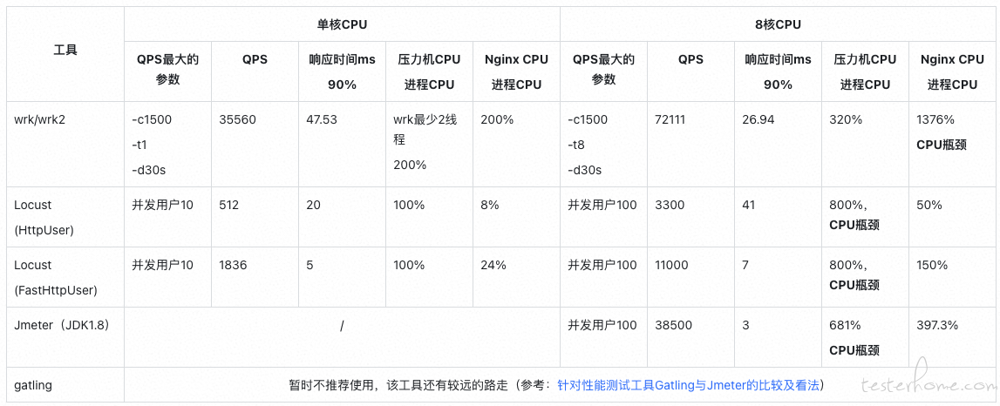
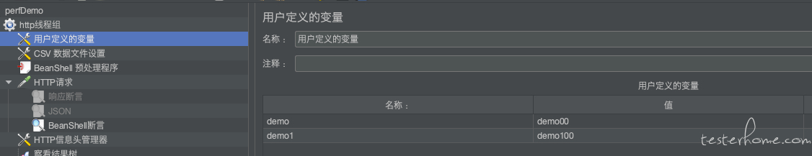
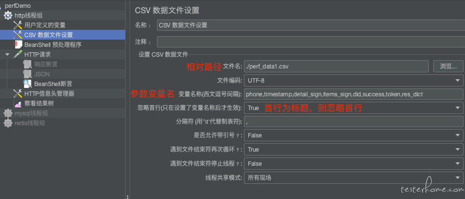
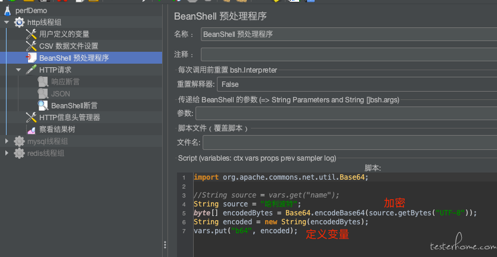

# 问题

### 1. 性能应该关注哪些指标？

一般来说，性能测试要统一考虑这么几个因素：Thoughput 吞吐量，Latency 响应时间，资源利用（CPU/MEM/IO/Bandwidth…），成功率，系统稳定性。

**（1）响应时间**：你得定义一个系统的响应时间 latency，建议是 TP95 或以上。响应时间具体要求多少，一般读不超过 200ms，写不超过 500ms。要是实在不知道，对标同行业竞品。
**（2）最高吞吐量**：TPS（每秒事务请求数）或 QPS（每秒请求量），在目标响应时间要求下，系统可支撑的最高吞吐量。
**（3）成功率**：在关注 QPS 和响应时间的同时，还要关注成功率。如果 QPS 和响应时间都满足性能要求时，请求成功率只有 50%，用户也是不会接受的。
**（4）性能拐点**：一般服务都有性能临界点。当超过临界点时，吞吐量非线性下降，响应时间指数级增加，成功率降低。
找到出现性能拐点的主要原因：
基于性能拐点主要原因设置高危性能报警线。此为高风险注意事项，因为一旦达到性能拐点，有可能会出现雪崩现象，造成极其严重的事故。
观察超过性能拐点后，系统是否会出现假死、崩溃等高风险事件。
**（5）系统稳定性**：保持最高吞吐量（目标响应时间下的最高吞吐量），持续运行 7*24 小时。然后收集 CPU，内存，硬盘/网络 IO，等指标，查看系统是否稳定，比如，CPU 是平稳的，内存使用也是平稳的。那么，这个值就是系统的性能。
**（6）极限吞吐量**：阶梯式增加并发压力，找到系统的极限值。比如：在成功率 100% 的情况下（不考虑响应时间的长短），系统能坚持 10 分钟的吞吐量。
**（7）系统健壮性：做 Burst Test。用第二步得到的吞吐量执行 5 分钟，然后在第四步得到的极限值执行 1 分钟，再回到第二步的吞吐量执行 5 钟，再到第四步的权限值执行 1 分钟，如此往复个一段时间，比如 2 天。**收集系统数据：CPU、内存、硬盘/网络 IO 等，观察他们的曲线，以及相应的响应时间，确保系统是稳定的。
**（8）低吞吐量和网络小包的测试**：有时候，在低吞吐量的时候，可能会导致 latency 上升，比如 TCP_NODELAY 的参数没有开启会导致 latency 上升（[详见 TCP 的那些事](https://coolshell.cn/articles/11564.html)），而网络小包会导致带宽用不满也会导致性能上不去，所以，性能测试还需要根据实际情况有选择的测试一下这两咱场景。

## 2. Jmeter 单机最大并发上限多少？和什么有关联？什么时候该分布式加压？

 **Jmeter 是 Java 开发的、基于多线程并发模型的压测工具。一个虚拟用户，就对应一个线程。Jmeter 实际上是通过频繁的上下文切换，切换线程来造成并发用户的现象的。** 所以，不同的用户模型，上下文切换对 CPU 造成的压力也是不一样的，从而测试出来的可支持的最大并发用户数也不一样。

面的条件 (等于或不止) 都会影响并发量:
1 客户端系统资源
2 请求复杂度
3 业务依赖
4 服务器的处理能力
5 网络资源

### 3. Jmeter 性能测试的参数怎么设定？

性能测试接口必须进行参数化，如果是固定数据，可能导致所有请求全部访问了缓存，这样就无法评估服务真实性能。

Jmeter 参数化有 3 种常用方法：用户自定义变量、csv 数据文件设置、BeanShell 预处理变量。

#### 用户自定义变量

可以设置一些常量变量。

#### csv 数据文件设置

可设置参数化数量较多常量。

#### BeanShell 预处理变量

当有些变量需要加解密处理时，就需要 BeanShell 预处理。

注意：Jmeter 通过 vars.put(“变量名”, “变量值”) 来声明 Jmeter 变量。

### 阐述你的性能测试流程？

### 如何理解压力测试，负载测试以及性能测试？

### jmeter如何设计性能测试场景？

### 你在性能测试中遇到哪些性能问题？是怎么分析的？

### 接口测试断言从哪些方面去设计?

### 依赖于第三方数据的接口如何进行测试？

### 接口产生的垃圾数据如何清理

### 若请求的接口需要先登录后方可请求，如何进行接口测试?

### 不可逆的操作，如何处理，比如删除一个订单这种接口如何测试

### 当一个接口出现异常时候，你是如何分析异常的

### 下个接口请求参数依赖上个接口的返回数据怎么处理

