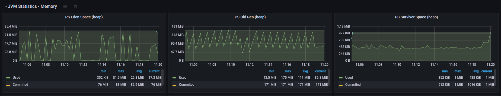

# 参考资料

[参考线程池泄露案例](https://www.cnblogs.com/thisiswhy/p/17036727.html)

> 该案例分析了没有正确设置线程池拒绝策略，会导致FutureTask任务的状态State属性依旧是NEW状态的原因（重点看这块内容的分析）。

[FutureTask代码分析](https://blog.csdn.net/xiaolyuh123/article/details/103288156)

[JAVA堆内存分析]()

> 关注eden、old、survivor的分析

[几种GC的性能消耗]()

> 关注marjor gc(ergonomics)、marjor gc(metadata gc threshold)、minor gc的性能消耗

# 案例代码

api1是没有正确设置线程池拒绝策略，导致内存泄漏接口、api2是正确设置线程池拒绝策略的接口，api3是一个普通负载测试接口，该接口调用生成UUID方法作为负载。

> 注意：
>
> 1. 在运行代码时，加上指定堆大小的参数，方便快速触发OOM和发生OOM把堆内存dump成文件的参数。
>
> ```text
> 例如：
> -Xmx256m -Xms256m
> -XX:+HeapDumpOnOutOfMemoryError 
> -XX:HeapDumpPath=C:/Users/SongJi/Desktop
> ```
> 2. 如下提供的代码，拥有小并发的情况下不会导致内存泄漏的问题，因为小并发情况下线程池没有触发拒绝策略。

* Controller代码

```java
@RestController
@RequestMapping(value = "/task4")
public class Task4Controller {
    @Resource
    private Task4Service service;

    @RequestMapping(value = "/api1")
    public ResponseBean api1() {
        service.task1();
        return ResponseBean.success(null, "");
    }

    @RequestMapping(value = "/api2")
    public ResponseBean api2() {
        service.task2();
        return ResponseBean.success(null, "");
    }

    @RequestMapping(value = "/api3")
    public ResponseBean api3() {
        service.task3();
        return ResponseBean.success(null, "");
    }
}
```
* 业务代码
```java
@Service
@Slf4j
public class Task4Service {
    private Map<Integer, Future<Result>> futureTaskMap = new ConcurrentHashMap<>();
    private ThreadPoolExecutor oomThreadPool = new ThreadPoolExecutor(1, 1, 60,
            TimeUnit.SECONDS, new ArrayBlockingQueue<>(100), new OOMRejectedPolicy());
    private ThreadPoolExecutor noOOMThreadPool = new ThreadPoolExecutor(1, 1, 60,
            TimeUnit.SECONDS, new ArrayBlockingQueue<>(100), new NOOOMRejectedPolicy());
    private AtomicInteger ids = new AtomicInteger();

//清理futureTaskMap中失效或者完成的task任务
    Thread saveThread = new Thread(() -> {
        while (true) {
            try {
                log.info(String.format("futureTaskMap size:%s", futureTaskMap.size()));
                Iterator<Integer> iterator = futureTaskMap.keySet().iterator();
                while (iterator.hasNext()) {
                    Integer key = iterator.next();
                    Future<Result> future = futureTaskMap.get(key);
                    if (future.isDone() || future.isCancelled()) {
                        if (future.isDone()) {
                            future.get();
                        }
                        futureTaskMap.remove(key);
                    }
                }
                Thread.sleep(1000);
            } catch (Exception e) {
                e.printStackTrace();
            }
        }
    }, "saveThread");

    public Task4Service() {
        saveThread.start();
    }

    public void task1() {
        int id = ids.getAndIncrement();
        Future<Result> submit = oomThreadPool.submit(() -> new Result(id));
        futureTaskMap.put(id, submit);
    }

    public void task2() {
        int id = ids.getAndIncrement();
        try {
            Future<Result> submit = noOOMThreadPool.submit(() -> new Result(id));
            futureTaskMap.put(id, submit);
        } catch (Exception e) {
            e.printStackTrace();
        }
    }

    //用于测试生成uuid速度接口
    public void task3() {
        String s = UUID.randomUUID().toString();
    }

}

class Result {
    public int id;

    public Result(int id) {
        this.id = id;
    }

    @Override
    public String toString() {
        return "Result{" + "id=" + id + '}';
    }
}

@Slf4j
class OOMRejectedPolicy implements RejectedExecutionHandler {

    @Override
    public void rejectedExecution(Runnable r, ThreadPoolExecutor executor) {
        log.warn("触发OOM溢出策略");
    }
}

@Slf4j
class NOOOMRejectedPolicy implements RejectedExecutionHandler {

    @Override
    public void rejectedExecution(Runnable r, ThreadPoolExecutor executor) {
        log.warn("触发溢出策略，并抛出异常");
        throw new RuntimeException("reject policy");

    }
}
```

# 实验测试

* 测试方案

  使用**Jmeter**分别对**泄漏测试：api1+api3**和**非泄露测试：api2+api3**组合的接口，进行高压力长时间的**TPS测试**

  > 注意：
  >
  > 1. 可以对泄漏测试进行小压力测试（调大线程池负载能力，即线程池中线程规模和阻塞队列大小）或降低Jmeter的负载压力，观察是否会发生泄漏。

* 测试结果

  * 泄漏测试

    泄漏测试时间持续近30分钟，前5分钟RT波动不大，5-12分钟RT的异常波动点明显增多，12分钟后平均RT激增，且异常点数量也明显增加。
    
    
    
  * 非泄漏测试
  
    泄漏测试时间持续近20分钟，没有出现RT激增问题，且平均RT稳定在4ms左右，但是RT毛刺点较多（具体原因未知）。
  
    
  
# 问题定位

* 定位工具软件

  * 监控曲线回看：Prometheus、SpringBoot Acutator（主要）、各类其它exporter（看情况说）、Grafana

  * 日志分析（看情况说不说、本次分析实际没用上，但是看了acutator的日志频率统计，因为触发拒绝策略一般都会通过log进行日志打印）：logstash、es、kibana

    > spring acutator有日志类型频率统计，如warn、error、info、debug的触发频率统计，也可用于日志初步定位

  * jvisulvm（内存泄漏定位）：分析dump文件定位内存泄漏点，也可用于实时监控Java线程，但是有了prometheus可以不用这个了。
  
    > 使用jvisulvm进行了监控测试，能监控的内容比较少，不过可以看出堆回收的曲线较频繁
  
    
  
  * arthas（内存文件dump）：本案例只是用heapdump命令将当前JVM线程的堆内存dump出来（顺便也可以说用dashboard命令或者thread命令查看了各线程资源使用情况）。
  
    > 注意：java本来自带的jmap也可以用于dump内存，需要用这些工具dump内存的原因是因为，即使配置了自动dump，JVM触发dump内存需要触发OOM异常，这个过程一般需要很久。

* 分析过程

  1. 监控曲线回看（用于初步确定是否存在内存泄漏）

     **堆内存分析：**

     > eden块（非泄露区域回收效果更好，绿色曲线经常能贴到底部）
     >
     > old块泄漏区在运行一段时间后绿色曲线贴着顶端（这里是否说明内存泄漏了？对象一直不能被回收，导致那些泄漏的futuretask进入了old区域，并且进入了old区域因为不能被回收所以导致old区域被用满了）
     >
     > suvivor块（非泄露区域经常保持一般的使用率，而泄漏区域运行一段时间后就贴底了）

     **GC分析：**

     > 两个模式最初都是用蓝色曲线gc且次数都差不多，但是测试中后段，对于泄漏模式绿色gc成为了主导，而非泄漏依旧是蓝色gc为主导，且泄漏模式stw的时间激增到了750ms，而非泄漏的stw依旧是50ms左右，依此可以估计绿色gc非常耗时，且可能是内存泄漏的标志信号。

     * 泄漏曲线

       

       

     * 非泄露曲线

       

       

  2. heap文件分析（确定内存泄漏以及泄漏源）

     > 使用jvisulvm查看heap文件，可以发现几个对象占用了大量内存，基本可以确定内存泄漏

     

     > 如分析第一个类ConcurrentHashMap$Node，进入查看字段和引用两列（主要看引用）。该节点字段中val对应的FutureTask对象，且引用段的引用树可以回溯到futureTaskMap这个对象，这个对象的位置是class ThreadPoolMain（是本案例定义的类的名称），到这里定位到泄漏源。

     

     

# 优化方案

* 修改拒绝策略即拒绝策略不能导致内存泄漏

  本案例设置了一个抛出异常的策略，确保futuretask的状态会改变，本优化方案解决了内存泄漏问题，但是还存在任务失败率过高的问题

  ```java
  @Slf4j
  class NOOOMRejectedPolicy implements RejectedExecutionHandler {
  
      @Override
      public void rejectedExecution(Runnable r, ThreadPoolExecutor executor) {
          log.warn("触发溢出策略，并抛出异常");
          throw new RuntimeException("reject policy");
  
      }
  }
  ```

* 调大线程池的基本参数

  调大线程池的基本参数，那么线程池更不容易触发解决策略，任务失败了显著会降低，吞吐量会上升。但是如果依旧可能会触发任务解决策略，并且提升是有上线的。

  * 适当调大coreporesize还有maxporesize
  * 调大ArrayBlockedQueueSize

  ```java
  //原线程池 
  private ThreadPoolExecutor noOOMThreadPool = new ThreadPoolExecutor(1, 1, 60,
              TimeUnit.SECONDS, new ArrayBlockingQueue<>(100), new NOOOMRejectedPolicy());
  //调大参数
  private ThreadPoolExecutor noOOMThreadPool = new ThreadPoolExecutor(1, 12, 60,
              TimeUnit.SECONDS, new ArrayBlockingQueue<>(1000), new NOOOMRejectedPolicy());
  ```

* 使用限流方案（本实验没使用）

  使用限流可以降低线程池压力，限流算法最好使用类似令牌桶。

* 搭配RocketMQ

  当触发了线程池拒绝策略后，将失败任务投递到消息队列，然后重消费，这样即保证了任务百分比百执行，也提高了吞吐量，如下案例测试了搭配消息队列的消息吞吐量和正确率。**直接写数据库大概吞吐量20w，使用拒绝策略但是不使用消息队列吞吐量40w但是成功写入的只有7w，使用消息队列的成功写入有28w（消息队列只使用了一个broker、且只有一个消费者），优化结果可以写吞吐量提高了4倍**。

  ```java
  public class Task3Service {
      @Resource
      private Task3Dao task3Dao;
  
      private final ThreadPoolExecutor executorWithMessage;
  
      private final ThreadPoolExecutor executorWithoutMessage;
      private RocketMQProducer producer;
  
      @Data
      @AllArgsConstructor
      class PeopleTask implements Runnable {
          private People people;
  
          @Override
          public void run() {
              Task3Service.this.task1(people);
          }
      }
      
      //初始化两个线程池
      public Task3Service() {
          executorWithoutMessage = new ThreadPoolExecutor(12, 24, 60,
                  TimeUnit.SECONDS, new ArrayBlockingQueue<>(10000), new ThreadPoolExecutor.AbortPolicy());
          executorWithMessage = new ThreadPoolExecutor(12, 24, 60,
                  TimeUnit.SECONDS, new ArrayBlockingQueue<>(10000), (r, executor) -> {
              log.warn("线程池触发拒绝策略");
              producer.sendMessage("demo54", ((PeopleTask) r).getPeople());
          });
      }
      //直接写数据库
      public void task1(People people) {
          task3Dao.insertPeople(people);
      }
  
      //不搭配消息队列，直接快速失败
      public void task2(People people) {
          executorWithoutMessage.execute(new PeopleTask(people));
      }
      //失败后使用消息队列
      public void task3(People people) {
          executorWithMessage.execute(new PeopleTask(people));
      }
  }
  ```

  ```java
  @Slf4j
  public class RocketMQConsumer implements RocketMQListener<String> {
  
      @Resource
      private Task3Service service;
      @Resource
      private ObjectMapper mapper;
  
      @Override
      public void onMessage(String s) {
          try {
              log.info("收到消息:{}", s);
              service.task3(mapper.readValue(s, People.class));
          } catch (JsonProcessingException e) {
              throw new RuntimeException(e);
          }
      }
  }
  
  ```

  

